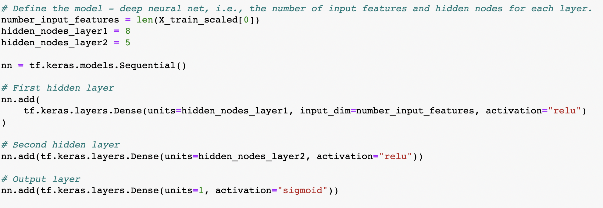
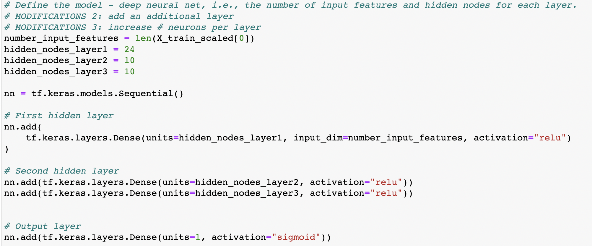

# Neural Network Charity Analysis

## Overview

Using neural network and deep learning algorithms from the TensorFlow library, we build a model to predict if applicants for charity funding will be use the money effectively. 

This is a binary classification problem. The dataset used to train and test the model contains more than 34,000 organizations that have received funding over the years, and includes information about the organizations such as type and funding amounts, and whether the funding was used effectively.

## Results

### Data Preprocessing

Variables that do not contribute to the model were removed:
- EIN
- NAME

Model target:
- IS_SUCCESSFUL - Was the money used effectively (1 = yes / 0 = no)

Model features:
- APPLICATION_TYPE — Alphabet Soup application type
- AFFILIATION — Affiliated sector of industry
- CLASSIFICATION — Government organization classification
- USE_CASE — Use case for funding
- ORGANIZATION — Organization type
- STATUS — Active status
- INCOME_AMT — Income classification
- SPECIAL_CONSIDERATIONS — Special consideration for application
- ASK_AMT — Funding amount requested                

To reduce the likelihood of overfitting the model, CLASSIFICATION and APPLICATION_TYPE categories with low frequencies were grouped into a "Other" bin. Categorical data were encoded into numerical values so that they can be evaluated by the model. Furthermore, the data was normalized and split into training and testing datasets.

### Building, Training, and Evaluating the Model

Initially, a 2-layer neural network using the ReLU activation function was used. Since it's a binary classification problem, a Sigmoid activstion function was chosen for the output layer. This model achieved a predictive accuracy of 72.66%, which is below the target of 75%.

The following modifications were made to try to improve the predictive accuracy:
1. adjusted the grouping of rare occurances of CLASSIFICATION to allow for more distinct groups, i.e., more granularity
2. increased the number neurson from 8 to 24 in layer one, and from 5 to 10 neurons in layer two
3. added a thrid ReLU hidden layer with 10 neurons
4. increased the number of epochs from 100 to 200

However, these modifications did not increase performance (accuracy = 72.41%), and the model's accuracy remains below 75%.

## Summary

Neither the original model nor the boosted deep neural network achieved the target accuracy of 75%. In fact, the more complex model increased run time without improving accuracy. As a next step, the problem should be explored using a random forest model, which can achieve comparable predictive accuracy on large tabular data with less code and faster performance.

